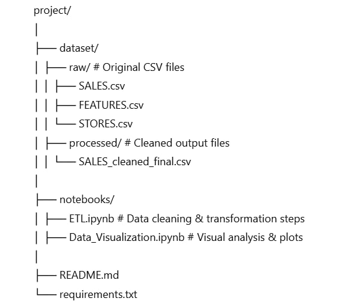

# 


---

# Project XYZ – Retail Sales ETL & Visualisation

## Overview

Retail Sales ETL and Visualization Project


Project XYZ is a comprehensive retail sales data analysis project that performs **ETL (Extract, Transform, Load)** on three related datasets — **FEATURES**, **STORES**, and **SALES** — to produce actionable business insights through data visualisation.

The focus was on **data cleaning, transformation, and exploration** using **Matplotlib** and **Seaborn** — without applying any machine learning algorithms — in order to understand sales behaviour, department performance, holiday effects, markdown impacts, and the influence of economic factors.

---

## Dataset Content

1. **STORES**

   * Store number (Store)
   * Store type
   * Store size

2. **FEATURES**

   * Store
   * Date
   * Temperature
   * Fuel Price
   * CPI (Consumer Price Index)
   * Unemployment rate
   * MarkDown variables (1–5)
   * IsHoliday flag

3. **SALES**

   * Store
   * Dept
   * Date
   * Weekly\_Sales
   * IsHoliday flag

---

## Business Requirements

* Understand overall sales trends across time.
* Measure the impact of markdowns on weekly sales.
* Compare performance between departments.
* Analyse sales during holiday and non-holiday periods.
* Explore the relationship between economic indicators and sales patterns.

---

## Hypothesis & Validation

1. **Holiday weeks drive higher sales** → Validate by comparing average weekly sales for holiday vs non-holiday periods.
2. **Markdowns increase sales but only up to a point** → Validate with scatter/line plots between markdown levels and weekly sales.
3. **Economic factors influence retail spending** → Validate by plotting correlations between CPI, fuel prices, unemployment, and weekly sales.

---

## Project Plan

**1. Extract**

* Imported three CSV datasets (**STORES**, **FEATURES**, **SALES**) into Pandas DataFrames.

**2. Transform**

* Converted date columns to datetime format.
* Merged datasets on `Store` and `Date` for consolidated analysis.
* Filled missing values for numeric columns using median values.
* Created derived features (Year, Month, Week number, Holiday indicators).

**3. Load**

* Final cleaned dataset stored in Pandas for visualisation.

**4. Analyse & Visualise**

* Created visualisations in Matplotlib and Seaborn for:

  * Weekly sales trends
  * Markdown impact
  * Department performance
  * Holiday vs non-holiday analysis
  * Economic indicators correlation
  * Initial EDA distributions and pair plots
  * ETL flow diagram

---

## Rationale: Mapping Business Requirements to Visualisations

| Business Requirement   | Visualisation                   | Rationale                              |
| ---------------------- | ------------------------------- | -------------------------------------- |
| Sales over time        | Line plot of total weekly sales | Shows seasonal demand changes          |
| Markdown impact        | Scatter/line plot               | Identifies optimal discount levels     |
| Department performance | Bar chart                       | Highlights strong and weak departments |
| Holiday effect         | Side-by-side bar/line plot      | Quantifies holiday sales boost         |
| Economic influence     | Multiple line plots             | Shows macroeconomic correlation        |

---

## Analysis Techniques Used

* **Descriptive statistics** – Mean, median, variance for sales distribution.
* **Correlation analysis** – Pearson correlation between economic variables and sales.
* **Time-series visualisation** – Weekly trends with moving averages.

**Limitations**

* No predictive modelling performed — analysis is purely descriptive.
* Economic indicators available at a weekly resolution; daily-level analysis not possible.

---

## Ethical Considerations

* Data contains no personal identifiers, ensuring privacy compliance.
* Avoided demographic-based conclusions to prevent bias.

---

## Data Visualisations & Analysis

### 1. Weekly Sales Overview


Shows overall sales trends across time, with visible peaks around holiday seasons.

### 2. Impact of Markdowns on Sales


Illustrates the relationship between promotional markdowns and sales volume.

### 3. Department-Level Performance


Ranks departments by their average sales, highlighting consistently strong performers.

### 4. Economic Trends vs Sales


Plots sales against CPI, fuel prices, and unemployment to identify correlations.

### 5. ETL Process Flow Diagram


Visual representation of the Extract, Transform, Load pipeline used.

### 6. Holiday Sales Analysis


Comparison of holiday and non-holiday weekly sales.

### 7. Initial Data Exploration


EDA plots showing distributions and correlations before deeper analysis.

---

## Main Data Analysis Libraries

* **Pandas** – Data cleaning, merging, and aggregation.
* **Matplotlib** – Custom visualisations for trends and comparisons.
* **Seaborn** – Statistical plots and aesthetic styling.
* **NumPy** – Numerical computations.

---

## Development Roadmap

* Expand analysis to include store size/type as segmentation factors.
* Automate ETL pipeline for faster updates with new data.
* Integrate interactive visualisations using Plotly or Dash.

---

## Deployment

This is a **local analysis project**; run it with:

```bash
pip install pandas matplotlib seaborn numpy
python analysis.py
```

---

## Credits

* Dataset: Public Walmart Retail Sales dataset (if applicable)
* Visualisation approach inspired by Matplotlib and Seaborn documentation.


